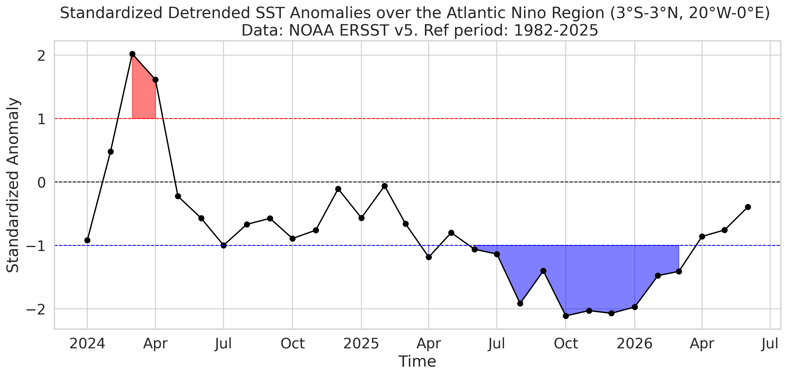
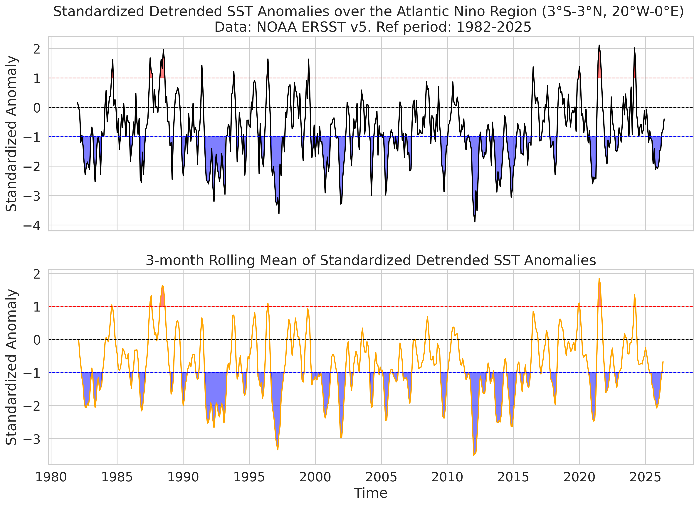
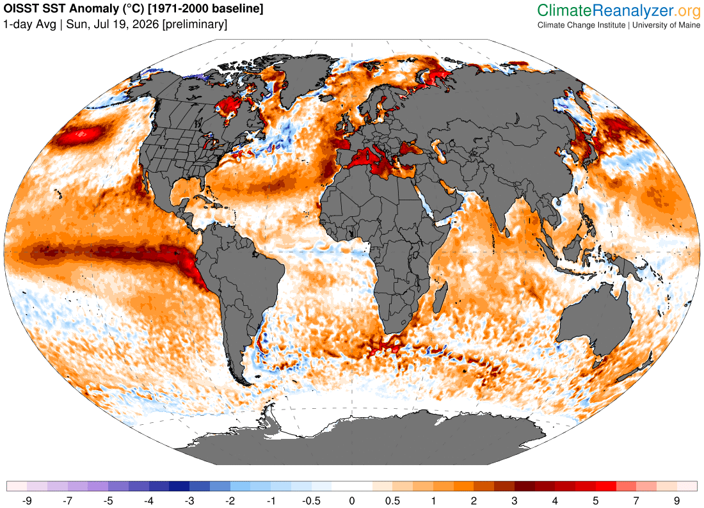
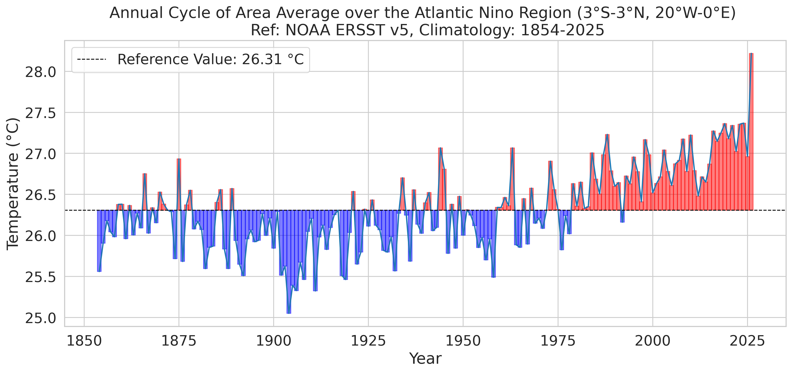
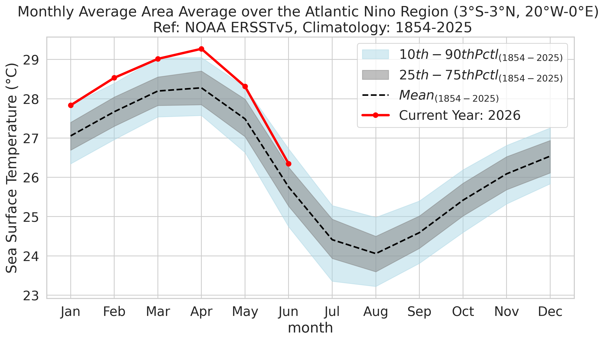

> **The Atlantic Niño is the dominant mode of interannual climate variability in the equatorial Atlantic Ocean. Although generally weaker than its Pacific counterpart (El Niño), it exerts a profound influence on regional climate, marine ecosystems, fisheries, and rainfall over West Africa and northeastern South America. This page provides an overview of the phenomenon, the physical processes that govern its evolution, monitoring products, datasets, forecasts, and links to current research.**

![ a) Regression of sea surface temperature (colors, in ◦C), sea level pressure (blue and red contours, in hPa)
and surface winds (arrows) anomalies onto the standardized JJAS Atlantic Niño index, over the period 1901 – 2010. Green contours
denote significant SSTAs at 95% confidence level (Student-test).  b) Same as in a), but for the vertically integrated moisture flux convergence (colors) and vertically integrated moisture flux (arrows) anomalies. Positive SST anomalies develop over the eastern and central equatorial Atlantic (ATL3 region), accompanied by anomalous westerly surface winds along the equator. These atmospheric anomalies reduce equatorial upwelling, deepen the eastern thermocline, and reinforce the warm SST anomalies through the Atlantic Bjerknes feedback. Positive (negative) moisture flux convergence indicates regions where atmospheric moisture accumulates (diverges), favouring enhanced (suppressed) precipitation. Source: @Worou_2020](images/atlantic_nino/azm_patterns_sst_vimfc.png){width=100%}

[Learn more →](more_about_azm.qmd) 

---

# Monitoring the current state

This section will be updated automatically using GitHub Actions.

## Current Atlantic Niño Index

{width=100%}

{width=100%}

---

## Sea surface temperature anomalies

{width=100%}

---

## Equatorial Atlantic Sea surface temperature evolution

{width=100%}

{width=100%}

---

## Surface winds

*(current wind field maps, available soon.)*

---

## Sea surface temperature anomalies

::: {.figure}

  

**Figure.** Global sea surface temperature anomalies (°C) relative to the 1991–2020 climatology. Source: [NOAA CPC](https://cpc.ncep.noaa.gov/products/GODAS/), @NOAA_CPC_Contacts.
:::

---

## Sea surface height anomalies

::: {.figure}

  

**Figure.** Sea surface height (SSH) anomalies. Source: [NOAA CPC](https://cpc.ncep.noaa.gov/products/GODAS/), @NOAA_CPC_Contacts.

:::

---

## Thermocline depth and subsurface conditions

::: {.figure}

  

**Figure.** Thermocline depth anomalies, indicated by the 20°C isotherm depth. Source: [NOAA CPC](https://cpc.ncep.noaa.gov/products/GODAS/), @NOAA_CPC_Contacts.

:::

::: {.figure}

  

**Figure.** Subsurface temperature anomalies (°C) relative to the 1991–2020 climatology. Source: [NOAA CPC](https://cpc.ncep.noaa.gov/products/GODAS/), @NOAA_CPC_Contacts.
Cross-section of the tropical basin, along the equator, showing the evolution of subsurface temperature anomalies over time. The vertical axis represents depth (in meters), while the horizontal axis represents longitude (in degrees). Positive anomalies indicate warmer-than-average conditions, while negative anomalies indicate cooler-than-average conditions.

:::

---

# Convective activity and precipitation

::: {.figure}

  

**Figure.** Outgoing longwave radiation (OLR) anomalies. Negative values indicate enhanced convection and precipitation, while positive values indicate suppressed convection and precipitation. Source: [NOAA PSL](https://psl.noaa.gov/data/gridded/data.interp_olr.html), @NOAA_PSL_DataUse.
:::

---

Animations focused on the Atlantic Ocean are available from [NOAA CPC](https://cpc.ncep.noaa.gov/products/hurricane/), @NOAA_CPC_Contacts.

[--> An example for the 31-day SST average](https://www.cpc.ncep.noaa.gov/products/hurricane/animation-html/sst_atl_31d_anim.html)

---

