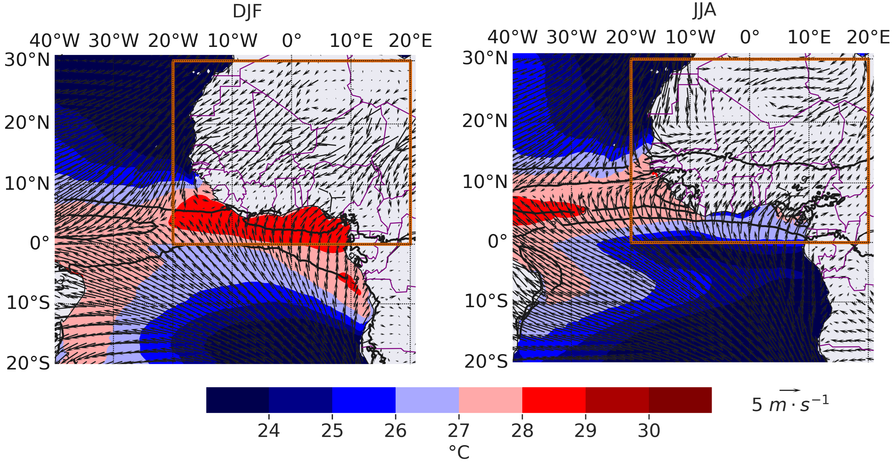

> **The Atlantic Niño is the dominant mode of interannual climate variability in the equatorial Atlantic Ocean. Although generally weaker than its Pacific counterpart (El Niño), it exerts a profound influence on regional climate, marine ecosystems, fisheries, and rainfall over West Africa and northeastern South America. This page provides an overview of the phenomenon, the physical processes that govern its evolution, monitoring products, datasets, forecasts, and links to current research.**

![ a) Regression of sea surface temperature (colors, in ◦C), sea level pressure (blue and red contours, in hPa)
and surface winds (arrows) anomalies onto the standardized JJAS Atlantic Niño index, over the period 1901 – 2010. Green contours
denote significant SSTAs at 95% confidence level (Student-test).  b) Same as in a), but for the vertically integrated moisture flux convergence (colors) and vertically integrated moisture flux (arrows) anomalies. Positive SST anomalies develop over the eastern and central equatorial Atlantic (ATL3 region), accompanied by anomalous westerly surface winds along the equator. These atmospheric anomalies reduce equatorial upwelling, deepen the eastern thermocline, and reinforce the warm SST anomalies through the Atlantic Bjerknes feedback. Positive (negative) moisture flux convergence indicates regions where atmospheric moisture accumulates (diverges), favouring enhanced (suppressed) precipitation. Source: [Worou et al. 2020.](https://doi.org/10.1007/s00382-020-05276-5)](images/atlantic_nino/azm_patterns_sst_vimfc.png){width=100%}

---

## Quick Facts

| | |
|:---|:---|
| **Primary region** | Equatorial Atlantic Ocean |
| **Monitoring index** | ATL3 (3°S–3°N, 20°W–0°) |
| **Typical season** | June–August |
| **Cold counterpart** | Atlantic Niña |
| **Main impacts** | West African rainfall, marine heatwaves, fisheries, tropical climate |

---

# What is the Atlantic Niño?

The Atlantic Niño is characterized by anomalous warming of sea surface temperatures (SSTs) in the eastern and central equatorial Atlantic Ocean. These warm anomalies typically develop during boreal spring, peak between June and August, and dissipate during autumn. Its cold counterpart, the **Atlantic Niña**, corresponds to anomalously cool SSTs over the same region.

Although it shares several characteristics with the Pacific El Niño–Southern Oscillation (ENSO), the Atlantic Niño differs in important ways. The tropical Atlantic is considerably narrower than the Pacific, the equatorial thermocline is shallower, and ocean–atmosphere interactions operate over shorter spatial and temporal scales. Consequently, Atlantic Niño events are generally weaker, shorter-lived, and more strongly modulated by the seasonal cycle.

The state of the Atlantic Niño is commonly monitored using SST anomalies averaged over the **ATL3 region (3°S–3°N, 20°W–0°)**.

---

# Why does it matter?

Despite its relatively small spatial extent, the Atlantic Niño influences weather and climate across the tropical Atlantic and surrounding continents.

Warm Atlantic Niño events are typically associated with

- enhanced rainfall along the Guinea Coast;
- modifications of the West African monsoon circulation;
- weaker equatorial upwelling;
- warmer upper-ocean temperatures;
- increased likelihood of marine heatwaves;
- impacts on marine ecosystems and fisheries.

Conversely, Atlantic Niña events often produce opposite anomalies.

---

# Physical mechanisms

## Mean state

Under climatological conditions, easterly trade winds drive surface waters westward, maintaining a shallow thermocline and vigorous upwelling in the eastern equatorial Atlantic. These processes give rise to the seasonal Atlantic Cold Tongue, which strongly influences regional climate.

::: {.callout-note}
**Suggested figure**

Mean SST, trade winds and thermocline depth.

{width=100%}

:::

---

## Initiation

Atlantic Niño events may be initiated by several processes, including

- westerly wind anomalies,
- stochastic atmospheric variability,
- remote forcing from ENSO,
- equatorial Kelvin waves,
- changes in the seasonal Atlantic Cold Tongue development.

---

## Atlantic Bjerknes feedback

Once initiated, ocean–atmosphere coupling amplifies the SST anomalies through the Atlantic Bjerknes feedback.

The sequence can be summarized as follows:

1. Westerly wind anomalies weaken the climatological trade winds.
2. The eastern equatorial thermocline deepens.
3. Upwelling weakens.
4. Sea surface temperatures increase.
5. Enhanced atmospheric convection develops over the eastern basin.
6. Atmospheric circulation further weakens the trade winds, reinforcing the warming.

::: {.callout-important}
### Suggested illustration

A schematic showing the Atlantic Bjerknes feedback.
:::

---

## Decay

Atlantic Niño events are usually short-lived. Their decay is promoted by

- seasonal migration of the ITCZ,
- strengthening southeasterly trade winds,
- enhanced upwelling,
- negative ocean–atmosphere feedbacks.

---

# Monitoring the current state

This section will eventually be updated automatically using GitHub Actions.

## Current Atlantic Niño Index

*(Insert latest ATL3 index.)*

---

## Sea surface temperature anomalies

*(Insert latest SST anomaly map.)*

---

## Equatorial SST evolution

*(Insert Hovmöller diagram.)*

---

## Surface winds

*(Insert wind anomaly maps.)*

---

## Thermocline conditions

*(Insert subsurface temperature or thermocline depth anomalies.)*

---

# Historical evolution

## Atlantic Niño Index

Display a time series from 1950 to present highlighting major warm and cold events.

---

## Major Atlantic Niño events

| Year | Category | Notes |
|------|----------|------|
| 1984 | Strong | Warm event |
| 1988 | Strong | Warm event |
| 1998 | Strong | Warm event |
| 2021 | Moderate | Warm event |

---

## Seasonal evolution

Suggested composite figures

- SST anomalies
- Wind anomalies
- Rainfall anomalies
- OLR anomalies

---

# Climate impacts

## West African Monsoon

Atlantic Niño events modify convection over the Gulf of Guinea and influence the northward migration of the Intertropical Convergence Zone (ITCZ). Warm events are generally associated with enhanced rainfall along the Guinea Coast, while impacts farther inland depend on season and regional circulation.

*(Insert rainfall composites.)*

---

## Marine Heatwaves

Warm Atlantic Niño conditions reduce equatorial upwelling and increase upper-ocean temperatures, creating favourable conditions for marine heatwave development in the eastern equatorial Atlantic.

This relationship forms one of the central themes of my current research.

*(Insert marine heatwave figure.)*

---

## Fisheries

Changes in SST and upwelling modify nutrient availability and marine productivity, influencing fisheries in the Gulf of Guinea and adjacent coastal regions.

---

## Tropical Climate

Atlantic Niño events also influence tropical atmospheric circulation, affecting the Atlantic ITCZ, African easterly waves, and potentially tropical cyclone activity.

---

# Predictability

Because of the relatively slow evolution of the tropical ocean, Atlantic Niño events can often be predicted several months in advance.

Forecast systems include

- ECMWF SEAS5
- Copernicus Climate Change Service
- North American Multi-Model Ensemble (NMME)

*(Insert forecast plume.)*

---

# Datasets

| Dataset | Variable | Resolution | Period |
|----------|----------|------------|---------|
| ERSSTv5 | SST | 2° | 1854–present |
| OISST | SST | 0.25° | 1982–present |
| ERA5 | Atmosphere | 0.25° | 1940–present |
| ORAS5 | Ocean | 0.25° | 1979–present |
| GODAS | Ocean | 1° | 1980–present |

---

# My Research

My research focuses on understanding the dynamics of extreme marine heatwaves in the equatorial Atlantic and their links with Atlantic Niño variability. Using observations, reanalysis products, climate models, and rare-event algorithms, I investigate the physical mechanisms governing extreme ocean warming and their impacts on West African hydroclimate, marine ecosystems, and coastal populations.

Future additions to this section will include

- Publications
- Research projects
- Interactive figures
- Animations
- GitHub repositories

---

# Atlantic Niño in Recent Years

Future case studies will document notable Atlantic Niño events and their associated impacts.

| Event | Description |
|--------|-------------|
| Atlantic Niño 2024 | Marine heatwaves in the Gulf of Guinea |
| Atlantic Niño 2021 | Enhanced Guinea Coast rainfall |
| Atlantic Niño 1998 | One of the strongest observed warm events |

---

# Further Reading

## Review papers

- Lübbecke, J. F., & McPhaden, M. J. (2017). *On the inconsistent relationship between Atlantic Niño and Atlantic hurricanes*. Geophysical Research Letters.
- Richter, I., Xie, S.-P., Behera, S. K., Doi, T., & Masumoto, Y. (2013). *Equatorial Atlantic variability and its relation to mean state biases in CMIP5*. Climate Dynamics.
- Zebiak, S. E. (1993). *Air–sea interaction in the equatorial Atlantic region*. Journal of Climate.

## Monitoring centres

- NOAA
- Copernicus Climate Change Service
- Mercator Ocean
- PIRATA

## Data portals

- NOAA PSL
- NOAA CPC
- Copernicus Marine Service
- ECMWF