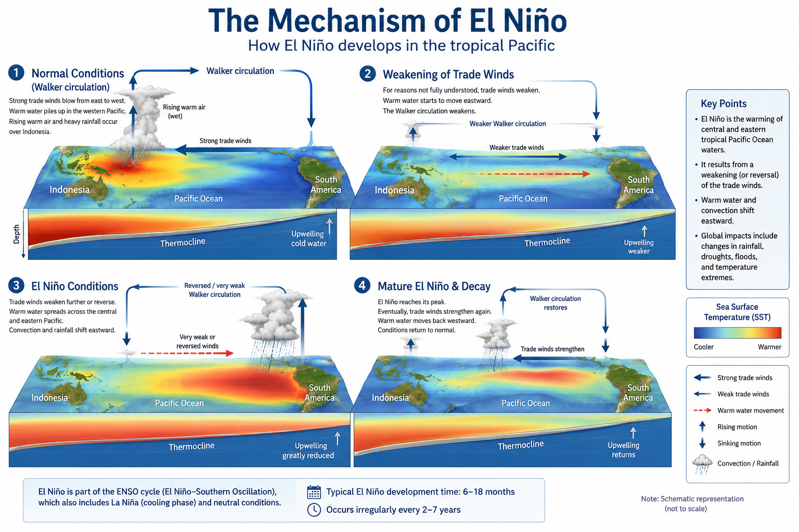

The **El Niño–Southern Oscillation (ENSO)** is the dominant mode of interannual climate variability in the tropical Pacific Ocean. Through changes in sea surface temperatures, atmospheric circulation, and ocean–atmosphere interactions, ENSO influences weather and climate patterns across the globe.

ENSO alternates between three phases:

- **El Niño**, characterized by warmer-than-average sea surface temperatures in the central and eastern equatorial Pacific.
- **La Niña**, characterized by cooler-than-average conditions in the same region.
- **Neutral**, when neither El Niño nor La Niña conditions are present.

These phases affect rainfall, temperature, tropical cyclone activity, droughts, floods, and marine ecosystems on multiple continents. Because of its far-reaching impacts, ENSO is one of the most closely monitored components of the Earth's climate system and plays a central role in seasonal climate prediction.

On this page, you will find an overview of the physical mechanisms driving ENSO, its global impacts, and links to operational monitoring products and forecasts.

---

## Illustration (Source: ChatGPT generated)

{fig-align="center" width="90%"}

---

## Current ENSO Conditions

ENSO conditions are monitored continuously using observations of sea surface temperatures, atmospheric circulation, and coupled ocean–atmosphere models. The resources below provide the latest assessment of ENSO status, forecasts, and associated climate outlooks.

The **NOAA Climate Prediction Center (CPC)** issues a monthly ENSO Diagnostic Discussion summarizing the current ENSO phase (El Niño, La Niña, or Neutral), the evidence supporting the assessment, and the forecast for the coming seasons.

Operational monitoring products provide a real-time overview of the current ENSO state, including sea surface temperature anomalies, atmospheric circulation, and seasonal forecasts.

{width=90%}

➡️ **[Explore the latest ENSO monitoring key animations, from NOAA CPC](enso_key_figures.qmd)**

➡️ **[Explore the latest ENSO monitoring figures, from NOAA CPC ENSO diagnostic discussion](enso_monitoring.qmd)**

➡️ [**ENSO Diagnostic Discussion is here**](https://www.cpc.ncep.noaa.gov/products/analysis_monitoring/enso_advisory/ensodisc.shtml)  and the link to the materials is [here](https://cpc.ncep.noaa.gov/products/precip/CWlink/MJO/enso.shtml).

### Additional Monitoring Resources

- 🌍 [**IRI ENSO Forecast**](https://iri.columbia.edu/our-expertise/climate/forecasts/enso/)
  

- 🌊 [**NOAA ENSO Blog**](https://www.climate.gov/news-features/blogs/enso)

- 📈 [**Australian Bureau of Meteorology (ENSO Outlook)**](https://www.bom.gov.au/climate/enso/)

- 🛰️ [**Copernicus Climate Change Service (C3S)**](https://climate.copernicus.eu/)

  