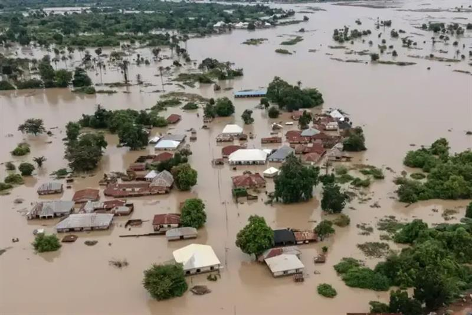

Extreme weather events—including heatwaves, droughts, floods, tropical cyclones, and wildfires—have profound impacts on societies, ecosystems, and economies worldwide. This page presents a curated selection of remarkable events that have attracted my attention in the context of my research on climate extremes, compound events, and their impacts. Each case study combines satellite observations, meteorological analyses, impact information, and, where available, event attribution studies.

 

## Featured Events

:::: {.grid}

::: {.g-col-12 .g-col-md-6 .g-col-lg-4}

::: {.card}

{fig-alt="Flooded neighbourhoods in Mokwa, Nigeria after the May 2025 flash flood"}

### Mokwa Flash Flood

**📍** Mokwa, Niger State, Nigeria  
**📅** 29 May 2025  
**🌧️** Flash Flood

A devastating overnight flash flood triggered by exceptionally intense convective rainfall claimed more than 150 lives and caused widespread destruction across Mokwa, Nigeria.

[**Explore the case study →**](events/mokwa_2025.qmd)

:::

:::

::::