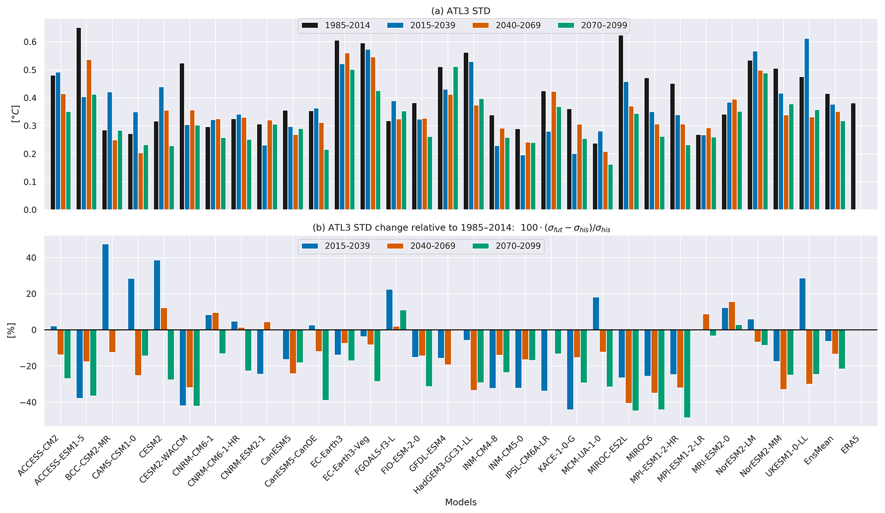

# Koffi Worou {.display-2 .text-center}

## Climate Physicist {.text-center .text-secondary}

Understanding climate variability and extremes from ocean dynamics to societal impacts.

[Research](research.qmd){.btn .btn-primary .btn-lg}
[Publications](publications.qmd){.btn .btn-outline-primary .btn-lg}
[CV](cv.qmd){.btn .btn-outline-secondary .btn-lg}

{fig-alt="Atlantic Niño research" width=100%}

---

## Research Highlights

:::: {.columns}

::: {.column width="33%"}

### 🌊 Ocean–Atmosphere Interactions

Atlantic Niño

ENSO

Indian Ocean Dipole

:::

::: {.column width="33%"}

### 🌍 Climate Extremes

Heatwaves

Droughts

Floods

Compound events

:::

::: {.column width="33%"}

### 🤖 AI & Climate 

LLMs

Climate databases

NLP

:::

::::

---