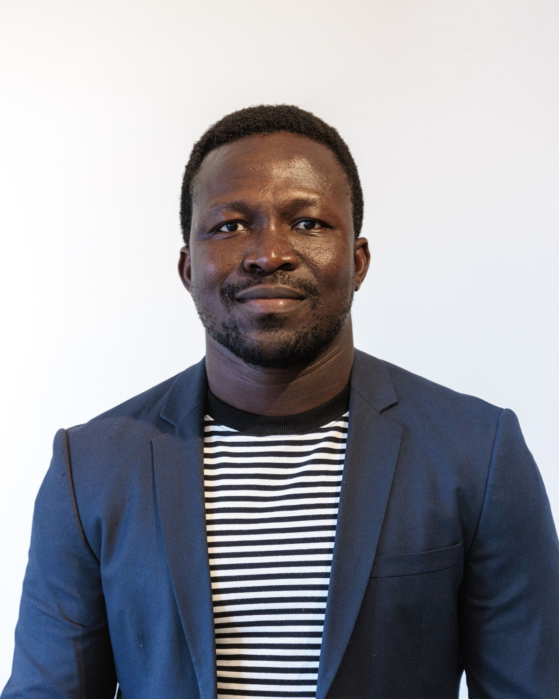

# **Dr. Koffi Worou** 

 

  

 

  

  **About me:**

I’m a climate physicist, and I hold a postdoctoral research position at Uppsala University, in the Air, Water, Landscape and Meteorology program of the Department of Earth Science. 

My interdisciplinary research activities focus on:

* The interranual variability of the climate system
* Compound weather and climate extremes, and their socio-economic impacts
* Large language models and their applications in climate science
* Climate impacts on health

 

---
