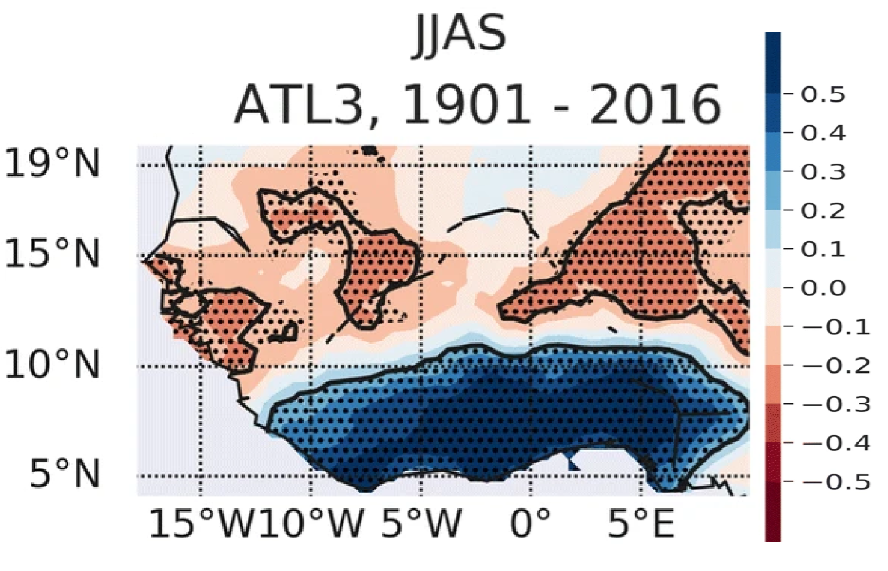

## Quick Facts

| | |
|:---|:---|
| **Primary region** | Equatorial Atlantic Ocean |
| **Monitoring index** | ATL3 (3°S–3°N, 20°W–0°) |
| **Typical season** | June–August |
| **Cold counterpart** | Atlantic Niña |
| **Main impacts** | West African rainfall, marine heatwaves, fisheries, tropical climate |

---

# What is the Atlantic Niño?

The Atlantic Niño is characterized by anomalous warming of sea surface temperatures (SSTs) in the eastern and central equatorial Atlantic Ocean. These warm anomalies typically develop during boreal spring, peak between June and August, and dissipate during autumn. Its cold counterpart, the **Atlantic Niña**, corresponds to anomalously cool SSTs over the same region.

Although it shares several characteristics with the Pacific El Niño–Southern Oscillation (ENSO), the Atlantic Niño differs in important ways. The tropical Atlantic is considerably narrower than the Pacific, the equatorial thermocline is shallower, and ocean–atmosphere interactions operate over shorter spatial and temporal scales. Consequently, Atlantic Niño events are generally weaker, shorter-lived, and more strongly modulated by the seasonal cycle.

The state of the Atlantic Niño is commonly monitored using SST anomalies averaged over the **ATL3 region (3°S–3°N, 20°W–0°)**.

---

# Why does it matter?

Despite its relatively small spatial extent, the Atlantic Niño influences weather and climate across the tropical Atlantic and surrounding continents.

Warm Atlantic Niño events are typically associated with

- enhanced rainfall along the Guinea Coast;
- modifications of the West African monsoon circulation;
- weaker equatorial upwelling;
- warmer upper-ocean temperatures;
- increased likelihood of marine heatwaves;
- impacts on marine ecosystems and fisheries.

Conversely, Atlantic Niña events often produce opposite anomalies.

---

# Physical mechanisms

## Mean state

Under climatological conditions, easterly trade winds drive surface waters westward, maintaining a shallow thermocline and vigorous upwelling in the eastern equatorial Atlantic. These processes give rise to the seasonal Atlantic Cold Tongue, which strongly influences regional climate.

::: {.callout-note}
**Suggested figure**

Mean SST, trade winds and thermocline depth.

{width=100%}

:::

---

## Initiation

Atlantic Niño events may be initiated by several processes, including

- westerly wind anomalies,
- stochastic atmospheric variability,
- remote forcing from ENSO,
- equatorial Kelvin waves,
- changes in the seasonal Atlantic Cold Tongue development.

---

## Atlantic Bjerknes feedback

Once initiated, ocean–atmosphere coupling amplifies the SST anomalies through the Atlantic Bjerknes feedback.

The sequence can be summarized as follows:

1. Westerly wind anomalies weaken the climatological trade winds.
2. The eastern equatorial thermocline deepens.
3. Upwelling weakens.
4. Sea surface temperatures increase.
5. Enhanced atmospheric convection develops over the eastern basin.
6. Atmospheric circulation further weakens the trade winds, reinforcing the warming.

::: {.callout-important}
### Suggested illustration

A schematic showing the Atlantic Bjerknes feedback.
:::

---

## Decay

Atlantic Niño events are usually short-lived. Their decay is promoted by

- seasonal migration of the ITCZ,
- strengthening southeasterly trade winds,
- enhanced upwelling,
- negative ocean–atmosphere feedbacks.

---

# Historical evolution

## Atlantic Niño Index

Display a time series from 1950 to present highlighting major warm and cold events.

---

## Major Atlantic Niño events

| Year | Category | Notes |
|------|----------|------|
| 1984 | Strong | Warm event |
| 1988 | Strong | Warm event |
| 1998 | Strong | Warm event |
| 2021 | Moderate | Warm event |

---

## Seasonal evolution

Suggested composite figures

- SST anomalies
- Wind anomalies
- Rainfall anomalies
- OLR anomalies

---

# Climate impacts

## West African Monsoon

Atlantic Niño events modify convection over the Gulf of Guinea and influence the northward migration of the Intertropical Convergence Zone (ITCZ). Warm events are generally associated with enhanced rainfall along the Guinea Coast, while impacts farther inland depend on season and regional circulation.

{width=100%}

---

## Fisheries

Changes in SST and upwelling modify nutrient availability and marine productivity, influencing fisheries in the Gulf of Guinea and adjacent coastal regions.

---

## Tropical Climate

Atlantic Niño events also influence tropical atmospheric circulation, affecting the Atlantic ITCZ, African easterly waves, and potentially tropical cyclone activity.

---

# Predictability

Because of the relatively slow evolution of the tropical ocean, Atlantic Niño events can often be predicted several months in advance.

Forecast systems include

- ECMWF SEAS5
- Copernicus Climate Change Service
- North American Multi-Model Ensemble (NMME)

*(Insert forecast plume.) To be developped*

---

# Atlantic Niño in Climate Models and Future Climate

Climate models are indispensable tools for understanding the dynamics of the Atlantic Niño and assessing how this mode of variability may evolve under anthropogenic climate change. Although simulating the tropical Atlantic remains more challenging than the tropical Pacific because of persistent model biases, recent advances in climate modelling have led to a much clearer picture of the future of the Atlantic Niño.

---

## Simulating the Atlantic Niño

State-of-the-art coupled climate models reproduce the principal characteristics of Atlantic Niño variability, including the seasonal development of the Atlantic Cold Tongue, the Atlantic Bjerknes feedback, and the associated atmospheric circulation anomalies. However, many models continue to exhibit systematic biases, such as

- an overly warm eastern equatorial Atlantic (the "warm bias");
- a weak or poorly represented Atlantic Cold Tongue;
- errors in the seasonal cycle of SST;
- biases in equatorial trade winds;
- an overly diffuse equatorial thermocline;
- weak ocean–atmosphere coupling.

These deficiencies influence both the simulated amplitude of Atlantic Niño events and their teleconnections to surrounding regions.

---

## A Robust Weakening Under Global Warming

Recent multi-model studies indicate that Atlantic Niño variability is **projected to weaken during the twenty-first century** under continued greenhouse gas emissions. Independent analyses using CMIP5 and CMIP6 simulations consistently show a reduction in the amplitude of SST variability in the eastern equatorial Atlantic (@Worou_2022, @Yang_2022, @Crespo_2022). This weakening is particularly pronounced in the boreal summer season, when Atlantic Niño events typically peak. 

Unlike ENSO, whose future evolution remains uncertain, the Atlantic Niño exhibits a remarkably robust response across climate models when those models realistically represent the present-day tropical Atlantic climate. :contentReference[oaicite:2]{index=2}

{width=100%}

---

## Why does the Atlantic Niño weaken?

The projected reduction in variability arises primarily from a weakening of the Atlantic Bjerknes feedback.

Several physical mechanisms contribute:

### A more stable atmosphere

As the tropical Atlantic warms, the lower atmosphere becomes increasingly stable. Consequently, zonal surface winds become **less sensitive to SST gradients**, weakening the atmospheric component of the Bjerknes feedback. :contentReference[oaicite:3]{index=3}

### A deeper eastern thermocline

Climate models project a deepening of the upper ocean in the eastern equatorial Atlantic. A deeper thermocline reduces the influence of subsurface temperature anomalies on sea surface temperatures, weakening the thermocline feedback. :contentReference[oaicite:4]{index=4}

### Reduced ocean–atmosphere coupling

Because both the atmospheric response and the oceanic thermocline response become weaker, the positive feedback that amplifies Atlantic Niño events becomes less efficient. As a result, SST anomalies are damped more rapidly, producing weaker Atlantic Niño and Atlantic Niña events. :contentReference[oaicite:5]{index=5}

{width=100%}

![Rainfall anomalies associated with the standardized JAS ATL3 SST index and averaged over 30◦ W and 10◦ E for oceanic
areas (a) and land areas (b). Gray bands in (a) and (b) represent the equatorial Atlantic and Guinea Coast regions, respectively. Zonal
variation of the JAS rainfall anomalies associated with the standardized JAS ATL3 SST index and averaged over the equatorial Atlantic (c)
and Guinea Coast regions (d). Zonal variation of the JAS 850 hPa zonal wind (e) and sea surface height anomalies (f) associated with the
standardized JAS ATL3 SST index and averaged over the equatorial Atlantic. In each panel, the solid black line represents ERA5 or ORAS5
for 1985–2014, and the other solid lines represent the ensemble mean of the 30 GCMs for the present and future periods. Figure retrieved from @Worou_2022.](images/atlantic_nino/cross_sections_projection_esd_paper.png){width=100%}

---

## Implications

A reduction in Atlantic Niño variability has important implications for climate variability around the tropical Atlantic.

Potential consequences include

- weaker interannual SST variability in the eastern equatorial Atlantic;
- reduced variability of equatorial trade winds;
- changes in seasonal predictability;
- altered rainfall variability over the Gulf of Guinea and West Africa;
- modifications to marine ecosystem variability;
- changes in the occurrence of Atlantic Niño–related marine heatwaves.

Importantly, **a weaker Atlantic Niño does not imply fewer marine heatwaves**. Greenhouse warming increases the mean ocean temperature, leading to more frequent and intense marine heatwaves, even as the interannual variability associated with Atlantic Niño decreases.

---

## My Contribution

My research has contributed to this emerging understanding by demonstrating a robust decline in Atlantic Niño variability in future climate projections. Using coupled climate model simulations, I showed that the weakening of the Atlantic Niño is closely linked to changes in the mean state of the tropical Atlantic and a reduction in the efficiency of ocean–atmosphere coupling.

These findings were published in @Worou_2022

The projected weakening identified in this work was independently confirmed by two complementary studies published simultaneously in *Nature Climate Change*, providing strong evidence that reduced Atlantic Niño variability is a robust feature of future climate projections (@Yang_2022, @Crespo_2022).

---

## Outstanding Questions

Although there is increasing consensus that Atlantic Niño variability will weaken, several important questions remain:

- How will reduced Atlantic Niño variability influence West African rainfall extremes?
- Will weaker interannual variability alter the predictability of seasonal climate?
- How will Atlantic Niño interact with increasingly frequent marine heatwaves?
- Can next-generation high-resolution Earth System Models reduce persistent tropical Atlantic biases?
- How will changes in Atlantic Niño affect marine ecosystems and fisheries in the Gulf of Guinea?

These questions continue to motivate ongoing research into tropical Atlantic climate variability and its impacts.
---

The variability of the Atlantic Niño will

# My Research

My research focuses on understanding the dynamics of extreme marine heatwaves in the equatorial Atlantic and their links with Atlantic Niño variability. Using observations, reanalysis products, climate models, and rare-event algorithms, I investigate the physical mechanisms governing extreme ocean warming and their impacts on West African hydroclimate, marine ecosystems, and coastal populations.

Future additions to this section will include

- Publications
- Research projects
- Interactive figures
- Animations
- GitHub repositories

---

# Atlantic Niño in Recent Years

Future case studies will document notable Atlantic Niño events and their associated impacts.

| Event | Description |
|--------|-------------|
| Atlantic Niño 2024 | Marine heatwaves in the Gulf of Guinea |
| Atlantic Niño 2021 | Enhanced Guinea Coast rainfall |
| Atlantic Niño 1998 | One of the strongest observed warm events |

---

# Further Reading

## Review papers

- Lübbecke, J. F., & McPhaden, M. J. (2017). *On the inconsistent relationship between Atlantic Niño and Atlantic hurricanes*. Geophysical Research Letters.
- Richter, I., Xie, S.-P., Behera, S. K., Doi, T., & Masumoto, Y. (2013). *Equatorial Atlantic variability and its relation to mean state biases in CMIP5*. Climate Dynamics.
- Zebiak, S. E. (1993). *Air–sea interaction in the equatorial Atlantic region*. Journal of Climate.

