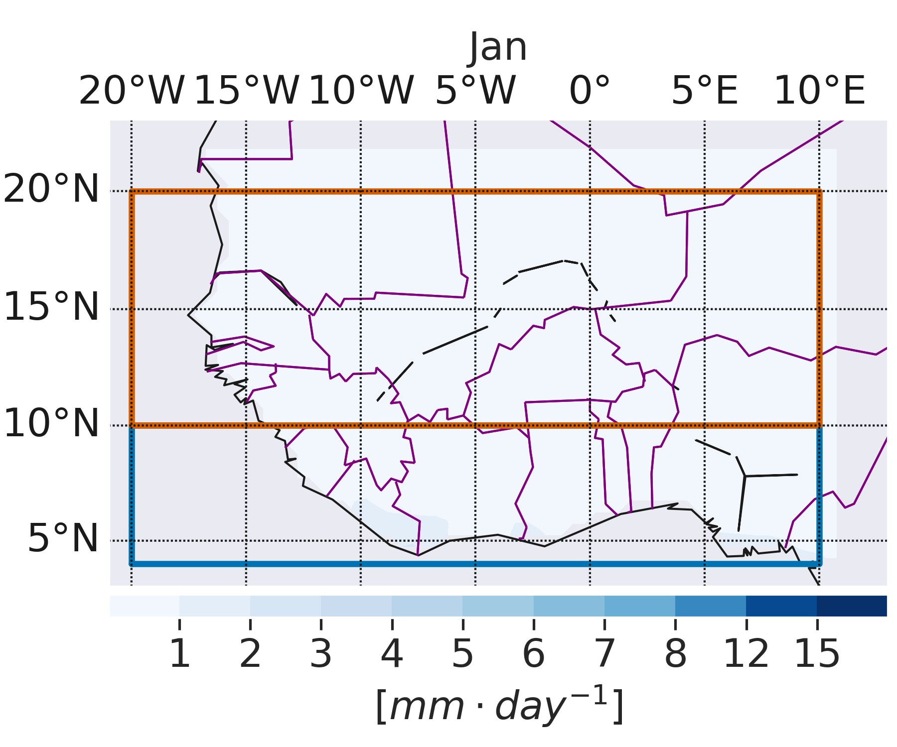
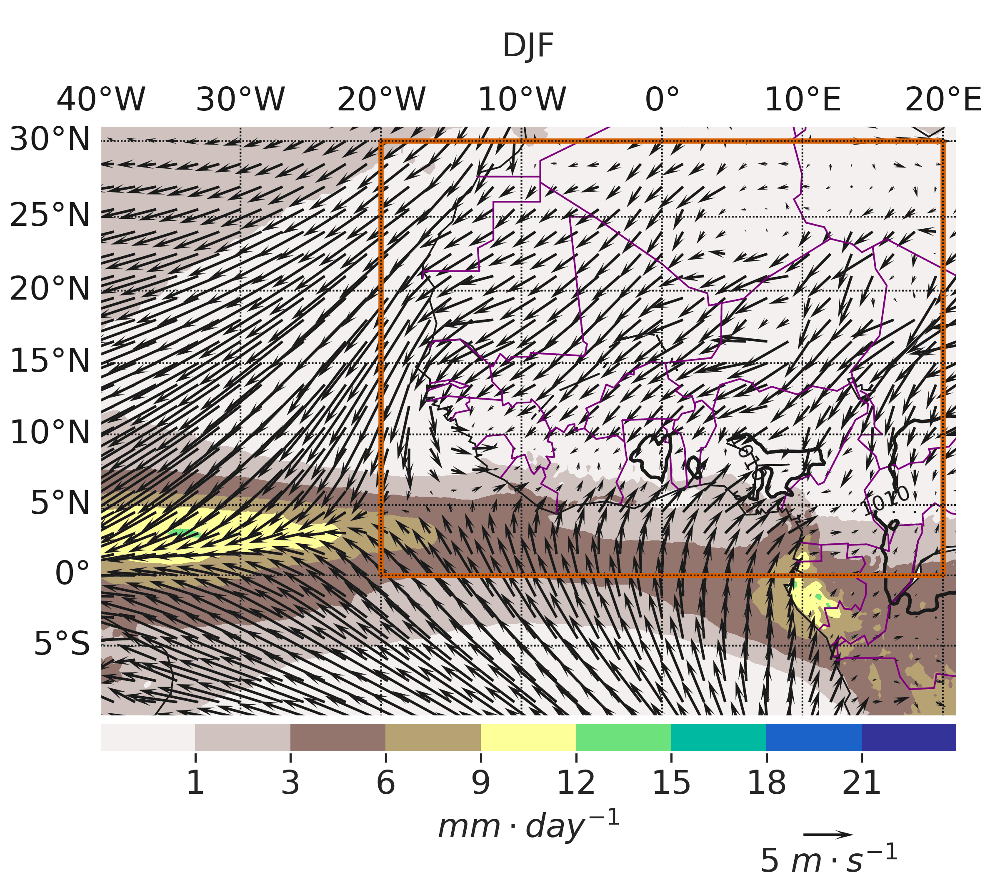

The **West African Monsoon (WAM)** is the dominant component of the West African climate system. It is a seasonal circulation driven by the contrast in heating between the African continent and the tropical Atlantic Ocean, bringing moisture-laden southwesterly winds inland during the boreal summer.

The monsoon supplies most of the annual rainfall over the Sahel and the Sudanian region, supporting agriculture, water resources, ecosystems, and the livelihoods of millions of people. However, its timing, intensity, and spatial distribution vary considerably from year to year, leading to floods, droughts, and other climate-related hazards.

Understanding the processes controlling the West African Monsoon is essential for improving seasonal climate predictions, enhancing early warning systems, and increasing resilience to climate variability and change.

---

## Seasonal Migration of Rainfall

The animation below shows the climatological monthly evolution of precipitation over West Africa during the period **1901–2020**. It illustrates the northward migration of the rain belt from the Gulf of Guinea during boreal spring to the Sahel in summer, followed by its southward retreat during autumn. This seasonal movement is a defining characteristic of the West African Monsoon.

{fig-align="center" width="90%"}

*Climatological monthly precipitation over West Africa (1901–2020). The animation highlights the seasonal migration of the West African rain belt.*

{fig-align="center" width="90%"}

## Large-scale Drivers

The West African Monsoon is influenced by several interacting components of the climate system, including:

- **Atlantic Niño**
- **El Niño–Southern Oscillation (ENSO)**
- **Atlantic Meridional Mode (AMM)**
- **Saharan Heat Low**
- **Madden–Julian Oscillation (MJO)**
- **Sea surface temperature anomalies in the Atlantic and Indian Oceans**

---

## Regional Impacts

Variations in the West African Monsoon affect:

- Seasonal rainfall and agriculture
- Water resources
- Food security
- Floods and droughts
- Heat stress and public health
- Energy production (e.g., hydropower)

---

## Monitoring and Forecasts

Operational centres continuously monitor the evolution of the West African Monsoon using satellite observations, atmospheric reanalyses, rainfall estimates, and seasonal prediction systems.

➡️ **Monitoring products and climate outlooks** *(coming soon)*